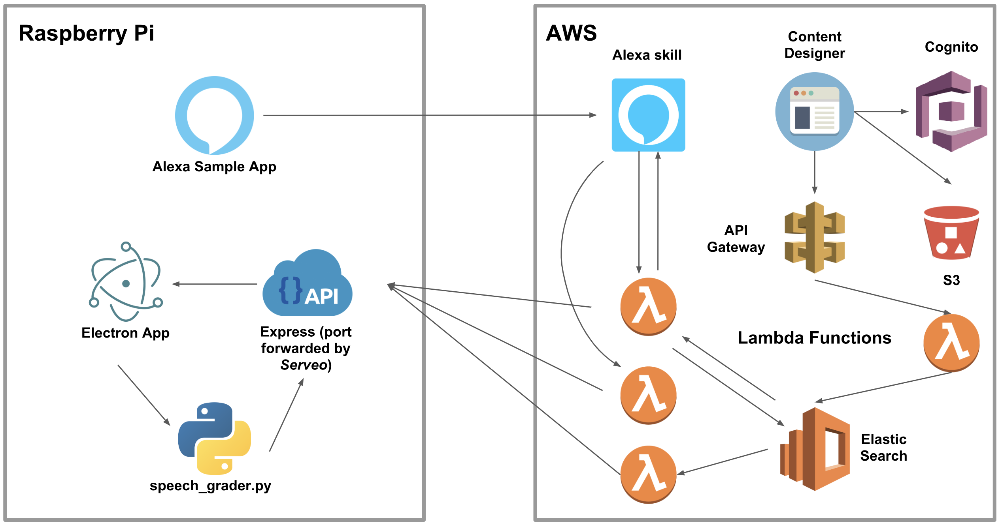

# Kagamirror

Kagamirror (鏡 + mirror) is a software system that powers a Smart Mirror prototype meant for EEE@NTU.

It is an Electron App that runs on Raspberry Pi and works with a few Amazon Web Services as well as a Python-based [SpeechRater](https://www.ets.org/research/topics/as_nlp/speech/)-like program, via a handful of REST APIs.

**This repo only contains a part of source codes currently.*

## Features

**Basic Display**
Similar to smart mirror apps created by enthusiasts, kagamirror displays date time, weather, news headlines and daily quotes.

**Notification**
Administrators can submit notifications via a designated Google Form and the messages are instantly displayed. Refer to `modules/notification/google_form`.

**School Events**
EEE school events are retrieved from [official website](http://www.eee.ntu.edu.sg/NewsnEvents/Pages/Events.aspx) and displayed with a list of scrolling emojis 📅.

**FAQ Bot**
Kagamirror embeds a question answering bot that answers to a list of FAQs related to school of EEE. The FAQs are selected from [AskNTU](http://askntu.ntu.edu.sg/home/ntu_wide/ifaq.aspx) and [those](http://www3.ntu.edu.sg/eee/students/orientation2017/full_time/docs/FAQ.pdf) published online by EEE. The bot is implemented using the AWS [QnA Bot](https://github.com/aws-samples/aws-ai-qna-bot) template integrated with Alexa.

**Speech Grader**
Like TOEFL's auto-scoring system, launching speech grader puts users into an oral test where they answer to a series of open-ended questions in voice. Their speeches are then graded using a Random Forest model. The implementation is based on the research *Automatic scoring of non- native spontaneous speech in tests of spoken English* [[link]](https://www.sciencedirect.com/science/article/abs/pii/S0167639309000703)

## Backend Architecture

***

## Frontend UI
&nbsp; [click here](https://github.com/Jun0413/kagamirror/blob/master/doc/mirror-ui.png)
